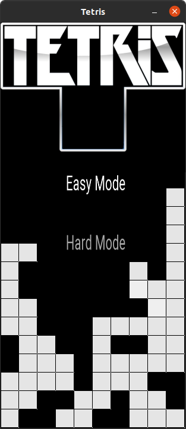

# ARM11 - Assembler and Emulator Project

This group project was developed for the Imperial College London COMP40009 Practical Programming module.

For this group project we implemented an assembler and emulator for a subset of the ARM11 assembly language, written in C. We then extended this to allow for a game of Tetris to be assembled and emulated.

## Assembler Structure

The assembler takes ARM11 assembly code and produces an executable binary file:

## Emulator Structure

The emulator takes this binary and simulates the ARM11 architecture. This is done by reading the binary file into memory, before fetching, decoding and executing the instructions within.

## Tetris Extension

The extension can be played by making the source code in [extension](./extension):

    $ make

The game can then be played by running the produced executable:

    $ ./tetris

- Move blocks with **Arrow** or **WASD** keys
- Fast-drop blocks with **SPACE**
- Reset the game with **R**

## Authors

This project was completed from May to June 2021, in conjunction with Anton Zhitomirsky, Sipan Petrosyan & Vincent Lee
